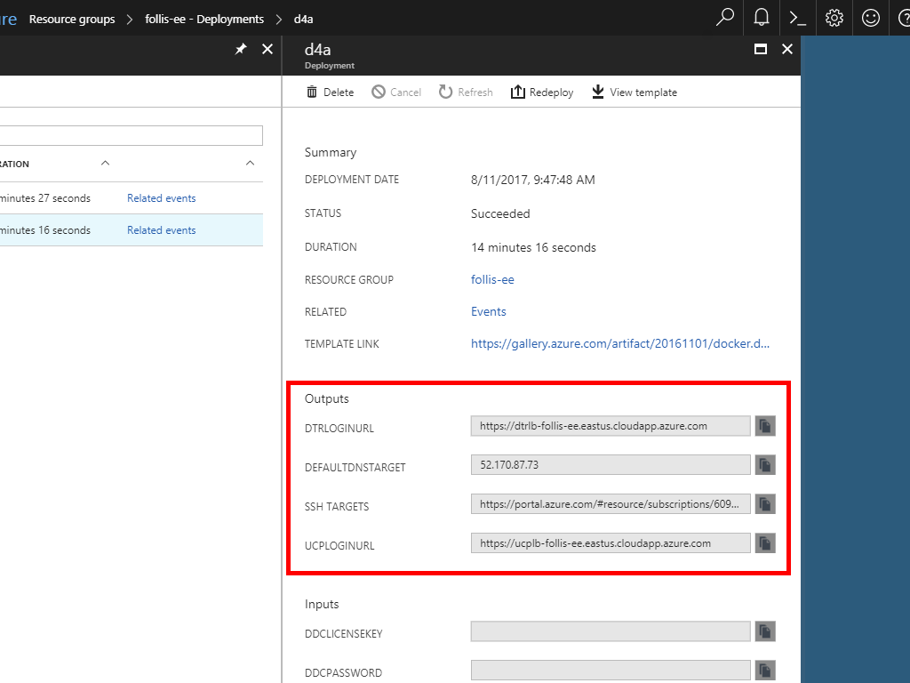

# Docker EE for Azure with Active Directory

The Docker Universal Control Plane (UCP) is capable of managing its own set of user accounts for authentication and authorization. However, customers with existing investments in Microsoft Active Directory may leverage AD for user management.

This Azure Resource Manager (ARM) Template provisions the following:

* Windows Server 2016 

* Desired State Configuration (DSC) VM Extension to enable and configure the Active Directory Domain Services Role

* PowerShell Custom Script Extension to pre-populate the directory with sample users and groups

## Architecture

Docker EE for Azure is the stock template that you'd be using if you provisioned via the Azure Marketplace. It deploys first.

After Docker EE finishes deploying its virtual network,  a Windows Server 2016 VM + NIC are provisioned inside of the existing VNet and Subnet. 

A Public IP resource is added for remoting into the machine via RDP. 

 

## Parameters
Before deployment you will need to provide parameters:

* **Ddc License Key** - the entire JSON file from `docker_subscription.lic` downloaded from Docker Store -> My Content -> Your Subscription. Simply copy + paste, doesn't need any encoding love.

* **Ad Service Principal App ID** - GUID representing the ID you generated for the SP

* **Ad Service Principal App ID** - GUID repesenting the password generated for the SP

* **Ssh Public Key** - `.pub` part of the public/private key pair. Paste right on into the box

* **Manager Count** - Odd number to ensure quorum can be maintained for the cluster

* **Manager VM Size** - Defaults to `Standard_D2_v2`

* **Worker Count** - Number of VMs for the worker nodes. Recommended to have 3+ to show workloads moving across workers

* **Worker VM Size** - Default to `Standard_D2_v2`

* **Domain Name** - Name used by AD. Defaults to `contoso.local` to match most AD starter guides. Feel free to adjust to another name

* **Number Users** - Max number of sample users to be generated. Will likely be slightly lower than this number, as duplicates will be dropped

> Be sure to scroll down and click the checkbox for `I agree to the terms and conditions stated above`. It's easy to miss

## Configuration
The template provisions all necessary infrastructure, however a bit of configuration will be necessary to plumb the components together.

> Screenshots are from Docker EE 17.03 and have not yet been updated to reflect the new user interface in Docker EE 17.06

### Configure LDAP
Once the deployment finishes, open the [Azure Portal](https://portal.azure.com) and navigate to **Resource Groups** -> **\<your RG Name>** -> **Deployments**.  The Deployments blade lists all deployments that have been executed within our Resource Group. 

Click the **dfa** row to open the deployment of Docker EE for Azure. Here you will find the **outputs** section of an ARM Template, including links to the UCP URL, DTR URL, and SSH URL. 

Click the square next to **UCPLOGINURL** to copy the URL to the clipboard. Then paste into a new browser tab. At the Docker UCP login screen, enter username `admin` and password `Docker123!` and click **Login**.

On the top navigation bar, select **Admin** to open the settings. Then from the left hand navigation, select **Auth**.  This page is where LDAP is configured for UCP, and where we will set UCP to talk to our Active Directory server. 

* **Method**: `LDAP`
* **Default Permission for New Users**: `View Only`
* **Recovery Admin Username**: `admin`
* **Recovery Admin Password**: `Docker123!`
* **LDAP Server URL**: `ldap://172.31.0.10` 
* **Reader DN**: `cn=reader,cn=Users,dc=contoso,dc=local`
* **Reader Password**: `Docker123!`
* **Skip Validation of server certficate**: checked

* **Base DN**: `cn=users,dc=contoso,dc=local`
* **Username Attribute**: `sAMAccountName`
* **Full Name Attribute**: `cn`
* **Filter**: `(&(objectClass=person)(objectClass=user))`

Save the settings by clicking the **Update Auth Settings** button and confirm the configuration. Click **Sync Now** and ensure the status indicator is green.

Finally, on the top navigation bar select **User Management** and verify that names are now present. LDAP sync has been enabled with a Windows Server Active Directory machine, all running in Azure.

### Configure Groups
To sync group memberships between Active Directory and UCP, we need to establish mappings between the two systems. On the **User Management** tab, select the **+ Create** button from the left navigation window. 

The script that pre-populated Active Directory with sample users also placed each user into one of two groups: "Engineering" or "Operations". To configure Engineering:

* Name the UCP team "Engineering"
* Enable Sync of Team Members to keep the membership up to date
* Match on LDAP Group Members from `cn=engineering members,cn=users,dc=contoso,dc=local` and on attribute `member`
* Repeat the process for "Operations"

Once the groups are established and syncing, permissions can be assigned to them. For the Developers group, click the **Permissions** tab and add a label for `prod` set to `View Only`. This should keep our trigger happy developers from mistakenly taking down any production nodes. 

## Remote Desktop
To remote desktop into the Domain Controller, use username `docker` and password `Docker123456!`. To download a pre-configured .rdp file, click the **Connect** button on the Overview Blade for the DC VM within the Azure Portal.

