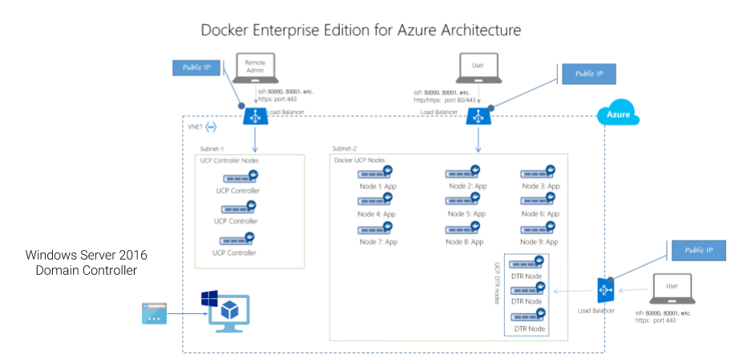

# Docker EE for Azure with Active Directory

The Docker Universal Control Plane (UCP) is capable of managing its own set of user accounts for authentication and authorization. However, customers with existing investments in Microsoft Active Directory may leverage AD for user management.

This Azure Resource Manager (ARM) Template provisions the following:

* [Docker Enterprise Edition for Azure](https://docs.docker.com/datacenter/install/azure/)

* Windows Server 2016 

* Desired State Configuration (DSC) VM Extension to enable and configure the Active Directory Domain Services Role

* PowerShell Custom Script Extension to pre-populate the directory with sample users and groups

## Prerequisites
The following are needed prior to running the template:

* Docker Enterprise Edition License - a free one month trial is available at the [Docker Store](https://store.docker.com/editions/enterprise/docker-ee-trial?plan=free-trial&plan=free-trial&tab=description)

* Azure Subscription - Available with an Enterprise Agreement, MSDN Subscription, or with the [free trial](https://azure.microsoft.com/en-us/free/)

* Service Principal access credentials, which you can generate by following the steps in [Docker for Azure Setup and Prerequisites](https://docs.docker.com/docker-for-azure/#configuration).

* An SSH public/private key pair, which you can generate by following the steps in [How to create and use an SSH public and private key pair for Linux VMs in Azure](https://docs.microsoft.com/en-us/azure/virtual-machines/linux/mac-create-ssh-keys). Save the public and private keys in a convenient location, like in the same directory as the Docker license, and be sure to remember the password for the key pair.

## Deploy the ARM Template

Click the following button to begin the provisioning process via the Azure Portal:

Ï

This file is also deployable via the [Azure CLI](https://docs.microsoft.com/en-us/azure/azure-resource-manager/resource-group-template-deploy-cli) or [PowerShell](https://docs.microsoft.com/en-us/azure/azure-resource-manager/resource-group-template-deploy).

## Parameters
Before deployment you will need to provide parameters:

* **Ddc License Key** - the entire JSON file from `docker_subscription.lic` downloaded from Docker Store -> My Content -> Your Subscription. Simply copy + paste, doesn't need any encoding love.

* **Ad Service Principal App ID** - GUID representing the ID you generated for the SP

* **Ad Service Principal App ID** - GUID repesenting the password generated for the SP

* **Ssh Public Key** - `.pub` part of the public/private key pair. Paste right on into the box

* **Manager Count** - Odd number to ensure quorum can be maintained for the cluster

* **Manager VM Size** - Defaults to `Standard_D2_v2`

* **Worker Count** - Number of VMs for the worker nodes. Recommended to have 3+ to show workloads moving across workers

* **Worker VM Size** - Default to `Standard_D2_v2`

* **Domain Name** - Name used by AD. Defaults to `contoso.local` to match most AD starter guides. Feel free to adjust to another name

* **Number Users** - Max number of sample users to be generated. Will likely be slightly lower than this number, as duplicates will be dropped

## Architecture

Docker EE for Azure is the stock template that you'd be using if you provisioned via the Azure Marketplace. It deploys first.

After Docker EE finishes deploying its virtual network,  a Windows Server 2016 VM + NIC are provisioned inside of the existing VNet and Subnet. 

A Public IP resource is added for remoting into the machine via RDP. 

 

## Configuration
The template provisions all necessary infrastructure, however a bit of configuration will be necessary to plumb the components together.

### Configure LDAP
TODO

### Configure Groups
TODO