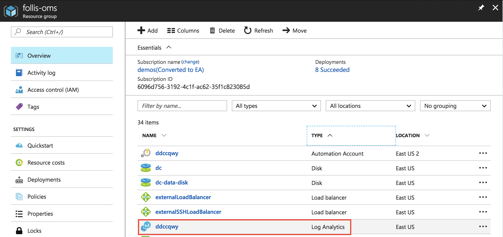
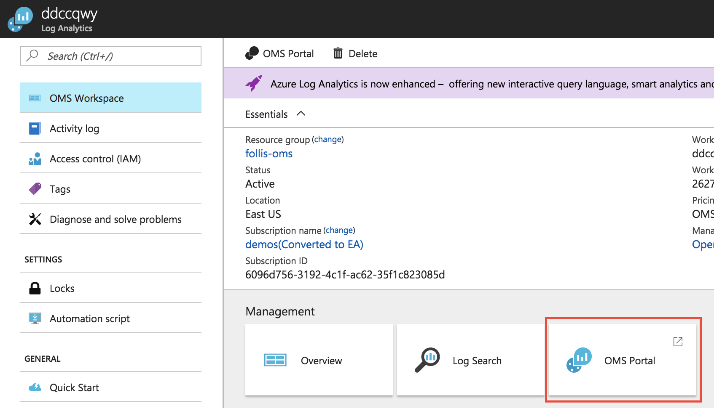
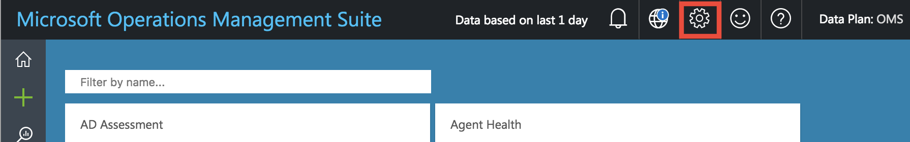
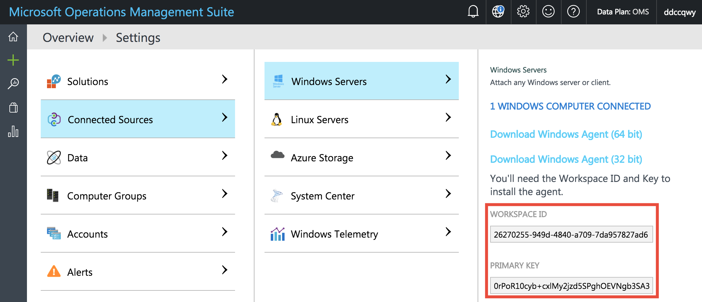
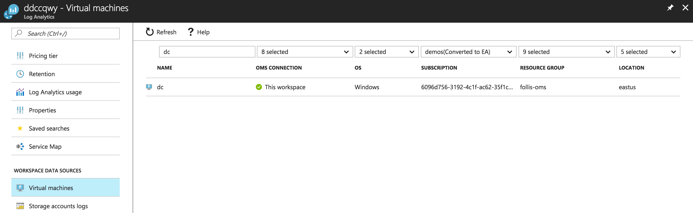
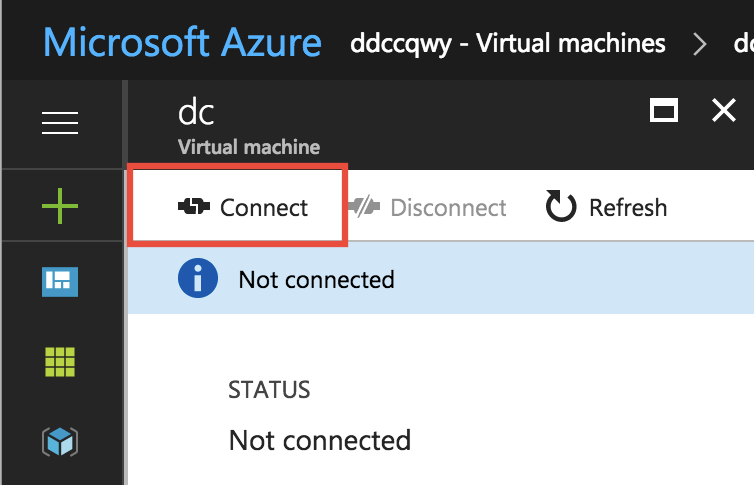

# Docker EE for Azure with Operations Management Suite

[Operations Management Suite (OMS)](https://docs.microsoft.com/en-us/azure/operations-management-suite/operations-management-suite-overview) is a collection of management services hosted in the cloud and used for monitoring of a variety of workloads.  

The recently GA'd [Container Monitoring Solution](https://docs.microsoft.com/en-us/azure/log-analytics/log-analytics-containers) is a turn-key solutino for keeping tabs on both Docker Swarm nodes, and running containers. 

## Configuration

After the template finishes provisioning, we will globally deploy the OMS Agent via the [microsoft/oms](https://hub.docker.com/r/microsoft/oms/) container to each node, using Secrets to pass in configuration information.  


### Retrieve Workspace details

The configuration information needed is the **OMS Workspace ID** and a **OMS Workspace Key**.  With this information, the OMSAgent can establish a link to our specific OMS instance and begin sending data.

From the Azure Portal, open the Resource Group blade for your deployment. Then select the **Log Analytics** instance.

> "OMS" is the umbrella term for several sub-components. One of these components in "Log Analytics"



From the OMS blade, click the tile for **OMS Portal**



In the OMS Portal, select the Settings Gear from the top toolbar



Select **Connected Sources** and **Windows Servers** to view your Workspace ID and Primary Key. Keep a note of those for the next step.



### Deploy Service

Back in UCP, [download your client bundle](https://docs.docker.com/datacenter/ucp/2.2/guides/user/access-ucp/cli-based-access/#download-client-certificates) containing your certificates and configure your local `DOCKER_HOST` variable by running the `env.sh` script.

Now that you're connected to the swarm, deploy a global service for the OMSAgent:

```sh
# Set workspace credentials
OMS_WORKSPACE=<your_workspace_id>
OMS_KEY=<your_workspace_primary_key>

# Create Secrets
echo $OMS_WORKSPACE | docker secret create OMS_WORKSPACE -
echo $OMS_KEY | docker secret create OMS_KEY -

# Confirm Secrets Creation
# Response should include OMS_WORKSPACE & OMS_KEY
docker secret ls

# Deploy Service
docker service create  \
    --name omsagent \
    --mode global  \
    --mount type=bind,source=/var/run/docker.sock,destination=/var/run/docker.sock \
    --secret source=OMS_WORKSPACE,target=WSID \
    --secret source=OMS_KEY,target=KEY  \
    --publish 25225:25225 \
    --publish 25224:25224/udp \
    --restart-condition=on-failure \
    --detach=false \
    microsoft/oms:latest

# Remove constraint to place on all nodes
docker service update \
    --constraint-rm node.labels.com.docker.ucp.collection.system!=true  \
    omsagent

# Confirm Service Creation
# Response should include "omsagent"
docker service ls
```

OMS is now configured and sending data from each node to OMS. After ~5 minutes, the OMS dashboard should begin showing information in the Containers tile. 

### Domain Controller

If you have also deployed the Active Directory Domain Controller template, add the OMSAgent to the VM through the Azure Portal. Open the Log Analytics blade as before, and select "Virtual Machines" on the left hand navigation. 



Select the **dc** VM and click the **Connect** button to automatically add the OMS Agent. 



## Documentation
* [Container Solution](https://docs.microsoft.com/en-us/azure/log-analytics/log-analytics-containers#linux-container-hosts#secure-your-secret-information-for-docker-swarm-and-kubernetes)